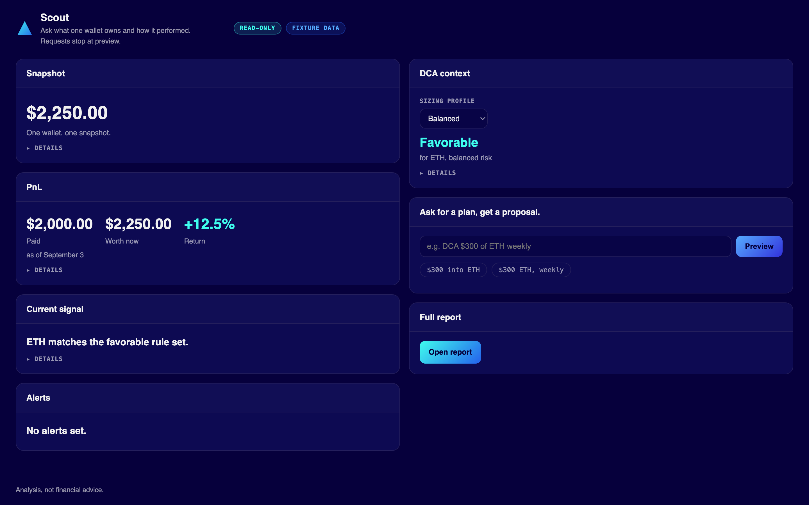

# Meet Scout

<p align="center">
  
</p>

<p align="center"><strong>Your agent should know what you own.</strong></p>

<p align="center">
  <a href="CLAIMS.md"></a>
  <a href="LICENSE"></a>
  <a href="START-HERE.md"></a>
</p>

Read-only portfolio intelligence for agents: 8 MCP tools, 264 offline tests, 0 execution paths. Snapshots, explainable USD PnL, DCA clarification, and approval-required previews. Fixture-backed by default; live Zerion is read-only and optional, one wallet.

## What Scout does

| | |
|:--|:--|
| Observe | Portfolio snapshot from fixture or optional Zerion |
| Calculate | Explainable PnL, fixture TA (`analyze_asset`, `dca_windows`) |
| Propose | DCA intent parsing and local on-demand alerts |
| Preview | Complete DCA preview with `approval_state=required` |

Eight MCP tools: `get_portfolio_snapshot`, `get_pnl`, `parse_dca_request`, `preview_dca`, `analyze_asset`, `dca_windows`, `set_alert`, `check_alerts`.

## Safety

Scout does not connect wallets, move funds, sign or submit transactions, or give investment advice. A preview is a proposal, not a trade. The no-execute claim is a CI gate: [`tests/test_execution_boundary.py`](tests/test_execution_boundary.py) AST-scans the import graph and pins the tool set to the 8 read-only tools.

Live stages: `observe -> calculate -> propose -> preview`. Execute and verify are not shipped. Buys and channel push alerts are roadmap. Zerion is env key + address only (not WalletConnect). Alerts are local on-demand files in `.scout/alerts.json`, not channel push.

Full truth table: [`CLAIMS.md`](CLAIMS.md). Per-host capability and evidence: [`HOST-MATRIX.md`](HOST-MATRIX.md). Boundaries: [`SECURITY.md`](SECURITY.md), [`DATA-AND-PRIVACY.md`](DATA-AND-PRIVACY.md), [`docs/ARCHITECTURE.md`](docs/ARCHITECTURE.md).

## Install

Give this repo folder or ZIP to your agent and point it at [`START-HERE.md`](START-HERE.md). Discovery is not install: confirm tools appear before trusting the host. The first ask after install: "Show me what I own and what it did."

| Route | Path |
|:--|:--|
| Claude Code plugin | START-HERE Route 1 |
| Codex (Agent Skills) | START-HERE Route 2 |
| Plain Python | START-HERE Route 3 |
| Cursor / any MCP (stdio) | START-HERE Route 4 (`.mcp.json`) |

Agent map: [`AGENTS.md`](AGENTS.md).

## Quick start (fixture)

```bash
python3.11 -m venv .venv
.venv/bin/pip install -e '.[test]'
.venv/bin/pytest -q
```

Or with `uv`:

```bash
uv sync --extra test --extra mcp
uv run pytest -q
```

264 tests, all offline against the fixture. Fixture example: 1 ETH bought at $2,000, valued at $2,250 ($250 unrealized). Synthetic data, not live markets.

```python
from scout_portfolio_manager.host import ReadOnlyHost

host = ReadOnlyHost("fixtures/portfolio.json")
host.get_pnl()
host.parse_dca_request("DCA another $300 of ETH")
```

DCA previews need amount, asset, chain, schedule, source, and destination. Missing fields are clarified, never guessed. Complete previews stay `approval_state=required` and `execution_available=false`.

## Demo

Offline browser demo at `demo/zerion-portfolio-agent/` (fixture only, no API key).

<p align="center">
  
</p>

```bash
uv run --project . demo/zerion-portfolio-agent/server.py
# open http://127.0.0.1:8787
```

Details: [`demo/zerion-portfolio-agent/README.md`](demo/zerion-portfolio-agent/README.md).

## Optional Zerion (read-only)

Both env vars required. Partial pair is a startup error. Keys never echo.

| Variable | Required | Meaning |
|:--|:--|:--|
| `ZERION_API_KEY` | yes | Read-only key from your secret manager |
| `ZERION_WALLET_ADDRESS` | yes | One wallet to observe |
| `ZERION_CHAIN` | no | Snapshot label (default `multi-chain`) |
| `ZPM_FIXTURE_PATH` | no | Fixture path when Zerion is off |

```bash
export ZERION_API_KEY=$(cat ~/secrets/zerion-api-key)   # never paste inline
export ZERION_WALLET_ADDRESS=0xYourWalletAddress
uv run --extra mcp zpm-mcp
```

API failure returns a typed error with `fallback: "none"`. The fixture is never substituted for a failed live call. See [`DATA-AND-PRIVACY.md`](DATA-AND-PRIVACY.md).

### Optional MCP server

```bash
.venv/bin/pip install -e '.[mcp]'
.venv/bin/zpm-mcp
```

Tools registered: `get_portfolio_snapshot`, `get_pnl`, `parse_dca_request`, `preview_dca`, `analyze_asset`, `dca_windows`, `set_alert`, `check_alerts`. The default remains fixture-backed and offline. Set `ZPM_FIXTURE_PATH` to use another local fixture, or set both `ZERION_API_KEY` and `ZERION_WALLET_ADDRESS` to observe one real wallet read-only (see above). `analyze_asset` / `dca_windows` use fixture price history unless documented otherwise. Alerts are local on-demand files, not channel push. No wallet connect UX, signing, submission, execution, or settlement-verification tool is registered.

## Docs

| Doc | Use |
|:--|:--|
| [`CLAIMS.md`](CLAIMS.md) | What is true today |
| [`HOST-MATRIX.md`](HOST-MATRIX.md) | Per-host capability and evidence |
| [`LICENSE-STATUS.md`](LICENSE-STATUS.md) | What MIT covers here, and what it does not |
| [`AGENTS.md`](AGENTS.md) | Agent install map |
| [`START-HERE.md`](START-HERE.md) | Exact install routes |
| [`SECURITY.md`](SECURITY.md) | Security boundary |
| [`DATA-AND-PRIVACY.md`](DATA-AND-PRIVACY.md) | Data handling |
| [`docs/ARCHITECTURE.md`](docs/ARCHITECTURE.md) | Runtime stages |
| [`docs/SHOW-ME.md`](docs/SHOW-ME.md) | Request and preview flow |
| [`CHANGELOG.md`](CHANGELOG.md) | Releases |
| [`SUPPORT.md`](SUPPORT.md) | Help |

## Status

`0.3.3` early release: fixture host, optional analytics and local alerts, optional read-only Zerion, optional MCP. Treat API-backed observations as external data with freshness and authorization limits.
